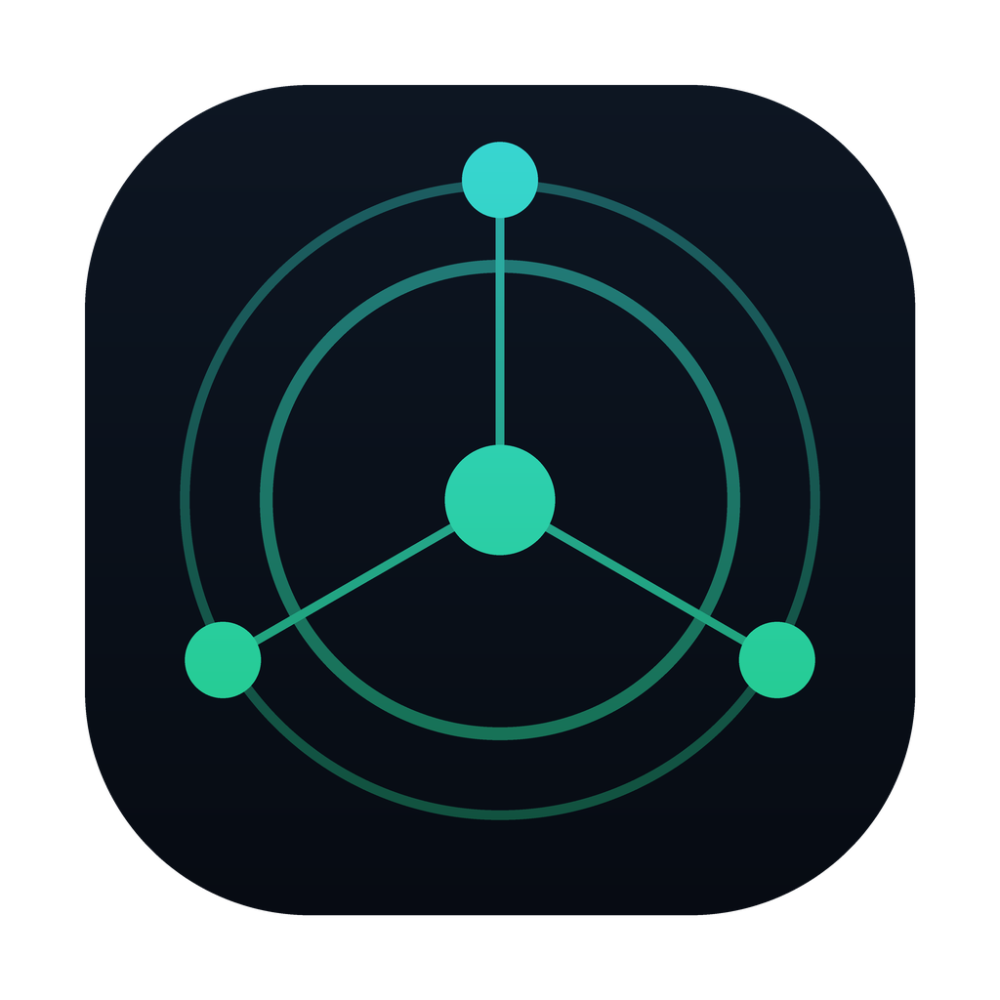
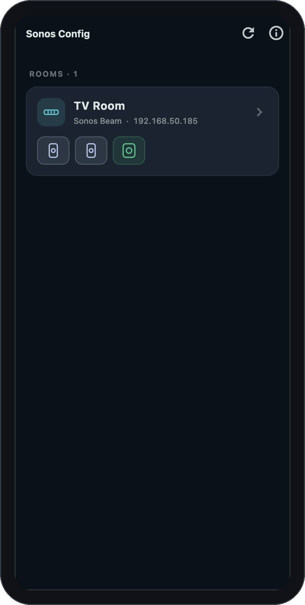
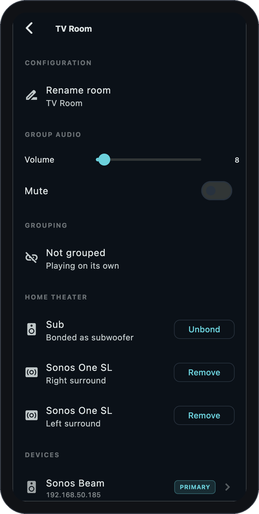
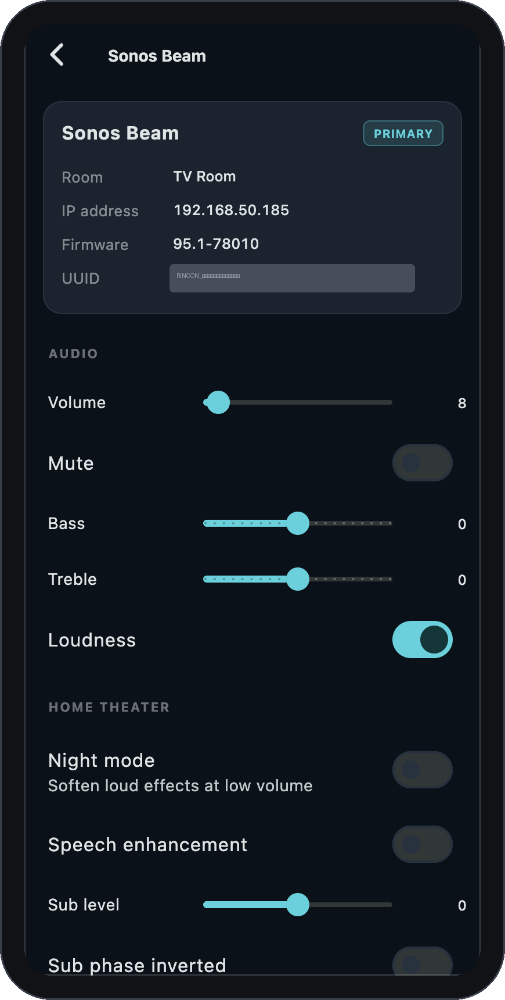
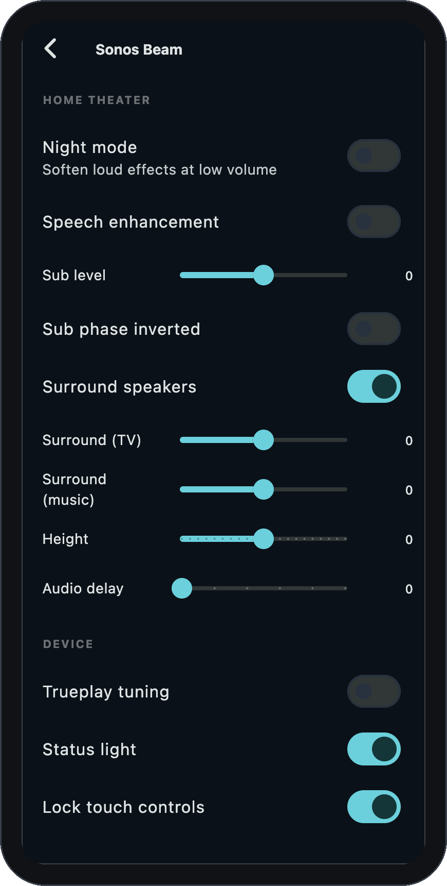

<p align="center">
  
</p>

<h1 align="center">Sonos Config</h1>

<p align="center">
  <a href="https://github.com/krugerm/sonos-config/actions/workflows/ci.yml"></a>
  <a href="LICENSE"></a>
</p>

> [!NOTE]
> **Why I built this.** The official Sonos app is slow and buggy — and it flatly
> refused to bond my Sub to my Beam. It kept marching me through a five-minute
> setup process, one prompt at a time, reporting success at the end… while
> actually failing, over and over. So I built this. It bonds the Sub in
> **under 3 seconds**, and it actually works. No warranties — use at your own risk.

A small, self-contained Flutter app to **discover and configure every Sonos
speaker on your local network** — no Sonos account, no cloud, no login. It talks
directly to your speakers over their local UPnP/SOAP interface, the same
protocol the official app and projects like [`node-sonos`](https://github.com/bencevans/node-sonos)
and [SoCo](https://github.com/SoCo/SoCo) use.

This is a **configuration tool, not a playback controller** — it does the setup
and topology operations the official app hides or gets wrong. Play music from
Spotify or wherever you like; use this to wire the system up.

> [!IMPORTANT]
> **Not affiliated with Sonos.** This is an independent, unofficial, community
> project. "Sonos" is a trademark of Sonos, Inc.; this project is not endorsed
> by, sponsored by, or associated with Sonos, Inc. It works by speaking the
> speakers' own local network protocol and comes with no warranty — you use it
> to change your own equipment's configuration at your own risk.

## Features

- **Automatic discovery** of all Sonos players via SSDP (UDP multicast), with a
  unicast subnet-scan fallback for Wi-Fi that blocks multicast.
- **System map** — every player with its model, IP, firmware, and how rooms,
  bonds and groups are wired, from a single `ZoneGroupTopology` query.
- **Bonding & topology** the official app struggles with — bond/unbond a **Sub**,
  add/remove **home-theater surrounds**, create/split **stereo pairs**, and
  **group/ungroup rooms** (party mode).
- **Room identity** — rename rooms, toggle the status LED, lock touch controls.
- **Audio tuning** — per-speaker volume + mute + balance, bass/treble, loudness;
  **group volume/mute**; and on home-theater bars, night mode, speech, **sub
  level/phase, surround level (TV & music), height, and audio delay**, plus
  Trueplay and fixed line-out where supported.
- **Guided & safe** — every topology change shows a plain-English before/after
  preview, applies, then **verifies the result after the speaker reboots**, with
  one-tap **undo** where a clean inverse exists. It never claims success it
  didn't see.
- **Capability-aware UI** — controls appear only when the device supports them.
  See [`docs/DEVICE_CAPABILITIES.md`](docs/DEVICE_CAPABILITIES.md) for the full
  per-device catalog of what's configurable.

## Screenshots

<p align="center">
  
  &nbsp;
  
  &nbsp;
  
  &nbsp;
  
</p>

<p align="center"><em>System map · room config (grouping, sub/surround bonding, group audio) ·
device audio &amp; EQ · home-theater tuning &amp; device settings</em></p>

## How it works

Sonos players expose a local UPnP stack on **port 1400**. This app speaks it
directly. Every new SOAP action is verified against the device's own service
description (`/xml/DeviceProperties1.xml`, `/xml/RenderingControl1.xml`) before
it's wired.

| Concern            | Mechanism                                                              |
| ------------------ | --------------------------------------------------------------------- |
| Discovery          | SSDP `M-SEARCH` for `urn:schemas-upnp-org:device:ZonePlayer:1`         |
| Topology           | `ZoneGroupTopology#GetZoneGroupState` → `Household` model              |
| Bond Sub / surround| `DeviceProperties#AddHTSatellite` / `RemoveHTSatellite`                |
| Stereo pair        | `DeviceProperties#CreateStereoPair` / `SeparateStereoPair`            |
| Rename / LED / lock| `DeviceProperties#SetZoneAttributes` / `SetLEDState` / `SetButtonLockState` |
| Audio / EQ         | `RenderingControl` — `SetBass`/`SetTreble`/`SetLoudness`/`SetEQ`/`SetVolume` |
| Grouping           | `SetAVTransportURI` `x-rincon:` / `BecomeCoordinatorOfStandaloneGroup` |
| Model / firmware   | `device_description.xml` + `SoftwareVersion` from topology            |

The SOAP envelope is hand-rolled in a compact client
([`soap_client.dart`](lib/src/services/soap_client.dart)) rather than pulling in
a heavyweight generic UPnP dependency.

### Core model

- **Device** — one physical player.
- **Room** — a coordinator plus its bonded satellites (sub/surrounds), shown as
  one configurable unit.
- **Group** — a party-mode set of rooms playing in sync (distinct from bonding).
- **ConfigAction** — every mutating change, with a `preview → apply → verify →
  undo` lifecycle run by the `ActionExecutor`.

### Open-source libraries leveraged

- [`http`](https://pub.dev/packages/http) — SOAP POSTs and device-description fetches.
- [`xml`](https://pub.dev/packages/xml) — parsing SOAP / topology XML.
- [`provider`](https://pub.dev/packages/provider) — state management.
- [`network_info_plus`](https://pub.dev/packages/network_info_plus) — local IP for
  the unicast discovery fallback.

## Project layout

```
lib/
  main.dart                       app entry, theme, store wiring
  src/
    models/                       Device, Room, Group, Household, Capabilities,
                                  BondRole, ChangeLine
    services/
      soap_client.dart            minimal Sonos SOAP client
      ssdp_discovery.dart         SSDP multicast + unicast fallback
      household_parser.dart       GetZoneGroupState -> Household
      device_info.dart            fetch modelName from device description
      sonos_api.dart              typed config/EQ actions
    actions/                      ConfigAction + bonding / rename actions
    state/
      household_store.dart        discovery + topology poll + enrichment
      action_executor.dart        guided-safe apply -> verify -> undo
      device_settings_store.dart  per-device audio + LED/button settings
    ui/
      system_map_page.dart        home: rooms + unbonded devices
      room_detail_page.dart       rename, Sub bonding, members
      device_detail_page.dart     diagnostics + capability-gated settings
      action_runner.dart          confirm -> progress -> result + undo
test/                             models, parsers, actions, stores, widget
docs/superpowers/                 design specs + phased implementation plans
```

## Running it

You need the [Flutter SDK](https://docs.flutter.dev/get-started/install)
(3.22+). The **device running the app must be on the same Wi-Fi/LAN as your
Sonos speakers.**

```bash
flutter pub get
flutter run -d macos     # primary target; also -d linux / ios / android / …
```

On first launch the app scans the network; grant the **local network** prompt on
iOS/macOS so discovery can work. If nothing is found, tap refresh to rescan.

## Platform permissions (already configured)

- **Android** — `INTERNET`, `ACCESS_WIFI_STATE`, `CHANGE_WIFI_MULTICAST_STATE`,
  and `usesCleartextTraffic` (Sonos control is plain HTTP).
- **iOS** — `NSLocalNetworkUsageDescription`, `NSBonjourServices`, and
  `NSAllowsLocalNetworking`. Sending SSDP multicast on a **physical** iPhone
  additionally requires Apple's
  [multicast networking entitlement](https://developer.apple.com/contact/request/networking-multicast);
  the unicast fallback works without it.
- **macOS** — sandbox `network.client` + `network.server` entitlements.

## Testing

```bash
flutter test      # models, parsers, actions, stores, widget (no hardware needed)
flutter analyze   # keep clean
```

Tests inject fakes (`FakeSoapClient` records SOAP calls and returns canned
responses; `SonosApi`/`SsdpDiscovery` are subclassed), so the whole discover →
topology → enrich → action-verify flow is exercised without a real speaker.

## Verified against real hardware

The read path (discovery, topology parsing, model enrichment, capability
derivation, and settings reads) and Sub bonding (`AddHTSatellite`) have been run
end-to-end against a real **Sonos Beam home theater** (Beam + two Sonos One SL
surrounds + a Sub). It has **not** been exercised from CI — an isolated sandbox
has no route to a home LAN — so run it at home on the same Wi-Fi as your system
to configure your own speakers.

## Contributing

Contributions welcome — see [`CONTRIBUTING.md`](CONTRIBUTING.md). The quality gate
is `flutter analyze` (clean) + `flutter test` (green); please keep both passing.

## License

[MIT](LICENSE) © Mike Kruger. "Sonos" is a trademark of Sonos, Inc.; this project
is not affiliated with or endorsed by Sonos, Inc.
